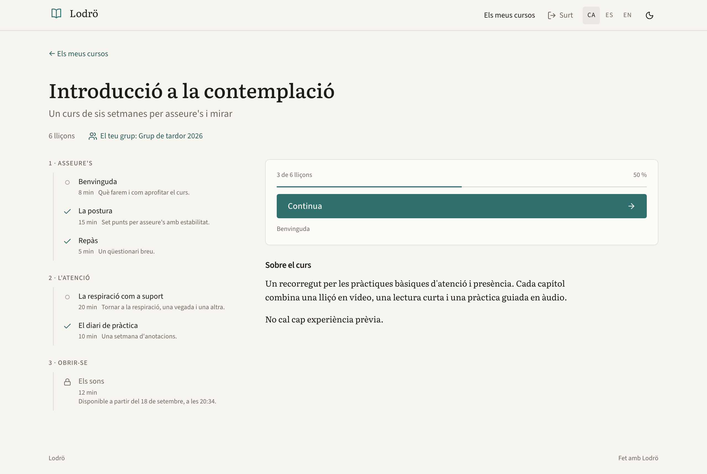
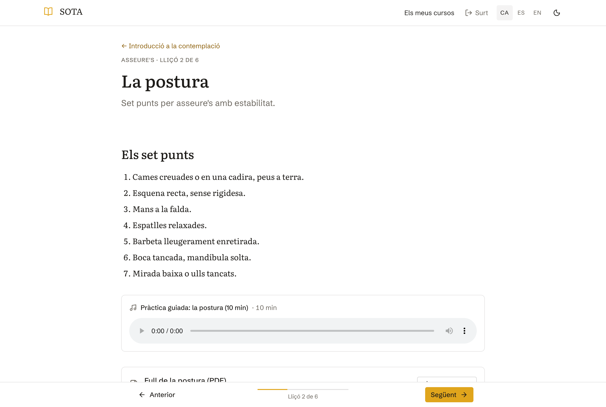
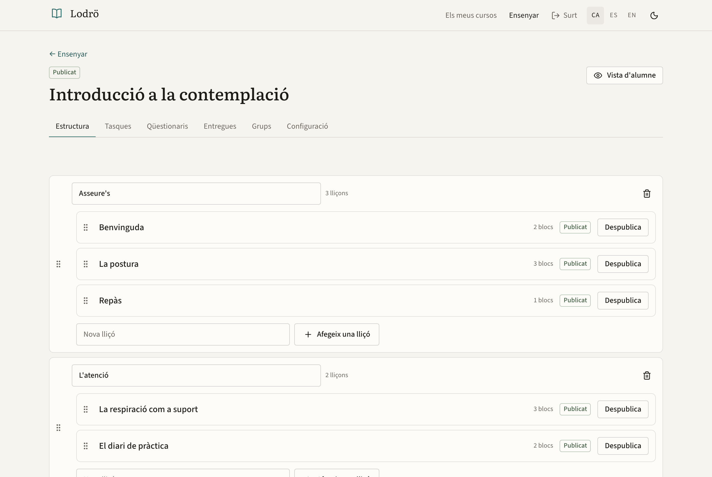

# SOTA

A lean, self-hostable, open-source course platform. Courses made of chapters made of lessons
(text, video, audio, files, embeds, assignments, quizzes), cohorts with drip release, per-lesson
progress. SOTA delivers the lessons; it does not sell anything. Who someone is comes from your
identity provider (or, for a small school, from SOTA's own accounts), and what they may open comes
from an enrollment source you control: your shop, a spreadsheet of names, an API call. SOTA never
handles payments.

The name is the Pali [_sotāpanna_](https://en.wikipedia.org/wiki/Sot%C4%81panna), "the one who
has entered the stream": the moment a path stops being an idea and becomes the direction you are
already moving in. SOTA wants to be that first step for the people who learn with it, and to get
out of the way once they are moving.

<p align="center">
  
</p>

**Stack** — TanStack Start (React 19, Router, Query, Form) on Vite · PostgreSQL 16 + Drizzle ·
better-auth (local accounts and a generic OIDC client) · files on disk or any S3 API · SMTP · Vimeo
behind a provider interface · Tailwind v4 with hand-written primitives · vitest + Playwright.

Spec: `docs/spec.md` · Decisions: `docs/decisions/` · Visual rules: `docs/DESIGN.md` ·
Agent rules: `CLAUDE.md` · History: `CHANGELOG.md`.

## What it does

- **Courses → chapters → lessons**, each lesson a stack of blocks: rich text (edited in place,
  stored as Markdown, with images and YouTube/Vimeo players), video (Vimeo), audio, files,
  allow-listed embeds, an assignment or a quiz.
- **Access decided by one pure function** from the enrollments (added by hand, by a pasted list or a
  cohort, pushed or pulled from your system, or read from the sign-in token), the course and lesson
  publish state, and the cohort's release schedule. Locked lessons say why and when.
- **Cohorts** with drip release by chapter or lesson (or "N chapters every D days"), automatic
  placement from a cohort-scoped enrollment, and a member page with the calendar.
- **Assignments** (text and/or file, resubmission, teacher review with feedback) and **quizzes
  or forms** (four question types, self-check feedback, results per option).
- **Progress** per lesson, media resume, "continue where you left off".
- **Teacher editor** with drag-sort, autosave, streamed uploads with progress, Vimeo lookup.
- **Forums**: one per course (teachers switch it on) and a general one. Threads pinned-first then
  by latest reply, quoting, like/dislike, moderation by the course's teachers.
- **Admin** area: people, enrollments with their origin, webhook log, audit log.
- **Notifications** by email: feedback at once, the rest in a daily digest.
- **Three locales** shipped (ca, es, en); dark theme; keyboard navigation in the player.
- **Content that moves**: `pnpm sota export` / `import` copy courses with their media between
  instances, idempotently.

| Lesson player                                 | Editor                                        |
| --------------------------------------------- | --------------------------------------------- |
|  |  |

## Quickstart

One machine with Docker, a `compose.yml` and a `.env`: no identity provider, mail server or cloud
account needed to start.

```bash
mkdir sota && cd sota
cp /path/to/checkout/compose.yml .         # or download it from the repository
cat > .env <<EOF
APP_URL=http://localhost:3003
SESSION_SECRET=$(openssl rand -base64 32)
POSTGRES_PASSWORD=$(openssl rand -hex 16)
SOTA_IMAGE=ghcr.io/<owner>/sota:1.0.0
EOF
docker compose up -d
docker compose exec app node scripts/sota.ts create-admin --email you@example.org --name "You"
```

Open http://localhost:3003 and sign in. **`docs/deploying.md` is the walkthrough** from here to a
published course and a learner who has finished it (reverse proxy, mail, upgrades); `docs/deploy.md`
is the reference, `docs/configuration.md` lists every variable, and `docs/backup-restore.md` says how
to save and restore what you build. Every version tag is published as `ghcr.io/<owner>/sota`
(`<owner>` is the account that owns the repository); without a registry, build the image from a
checkout (`docker build -t sota:local .`) and set `SOTA_IMAGE=sota:local`.

## Who signs in

`AUTH_MODE` picks who owns identity (ADR-013):

- **`local`** (default): email and password, magic link, administrator invitations, optional
  self-registration. SOTA keeps the accounts. Needs only Postgres.
- **`oidc`**: sign-in is delegated to your identity provider (Keycloak, Authentik, Entra, Google...):
  SOTA mirrors the person, takes roles from a claim and, if you like, enrollments from another claim.
  No local sign-up or password exists apart from an optional break-glass administrator.

See `docs/idp-integration.md` and `docs/integration.md`.

## Look and feel

A deployment looks like itself without touching `src/`: a theme directory (`THEME_DIR`) with
`theme.json` (name, logo, colours, fonts, default language), a stylesheet, reworded copy, mail
layouts and, if needed, replacement React slots. Two complete examples are in `examples/themes/`;
`pnpm sota validate-theme` checks yours. Everything is in `docs/theming.md`.

## Connecting your system

- **Enrollment source** (`docs/entitlements-contract.md`): SOTA pulls a person's enrollments at
  sign-in, or your system pushes the complete set over a signed webhook.
- **Service API** `/api/v1` (`docs/integration.md`): `PUT`/`DELETE /enrollments/{external_id}` for one
  order at a time, progress and course reads, an OpenAPI document at `/api/v1/openapi.json`; bearer
  token and optional HMAC signature.
- **Claims**: an ID-token claim can carry the person's enrollments directly.

Every enrollment change, from any of these or from an administrator, lands in the audit log with
before and after (`docs/audit-log.md`).

## Operating it

JSON logs and a health endpoint (`docs/observability.md`), built-in rate limits
(`docs/configuration.md`), content export and import (`docs/content-export-import.md`), backups
(`docs/backup-restore.md`).

## Develop

```bash
git clone <repository-url> sota && cd sota
cp .env.example .env
pnpm install                                                # installs the git hooks too
docker compose -f compose.dev.yml up -d postgres mock-idp   # services only
pnpm db:migrate && pnpm db:seed
pnpm dev                                                    # http://localhost:3003
```

Sign in through the mock identity provider on port 3013 (student, delayed-access student, teacher,
admin) or run the whole stack with `docker compose -f compose.dev.yml up`.

| Command                                                   | What                                                                                       |
| --------------------------------------------------------- | ------------------------------------------------------------------------------------------ |
| `pnpm dev` / `pnpm build` / `pnpm start`                  | dev server · production build · serve `dist/`                                              |
| `pnpm typecheck` · `pnpm lint` · `pnpm fmt` · `pnpm test` | the gates the pre-commit hook mirrors                                                      |
| `pnpm e2e`                                                | Playwright suites against the compose stack                                                |
| `pnpm db:generate` / `pnpm db:migrate` / `pnpm db:seed`   | new migration from the schema · apply · demo data                                          |
| `pnpm sota <command>`                                     | `migrate`, `seed`, `create-admin`, `validate-config`, `validate-theme`, `export`, `import` |
| `pnpm notify`                                             | one notification tick (mail and digest)                                                    |
| `pnpm mock-idp`                                           | run the development IdP + enrollment source alone                                          |

Releases: bump `package.json` and `CHANGELOG.md` on main, tag `vX.Y.Z` and push the tag;
`.github/workflows/release.yml` runs CI and publishes the image.

## Contributing and licence

See `CONTRIBUTING.md`. Security reports: `SECURITY.md`. SOTA is released under the MIT licence
(`LICENSE`, ADR-006).
